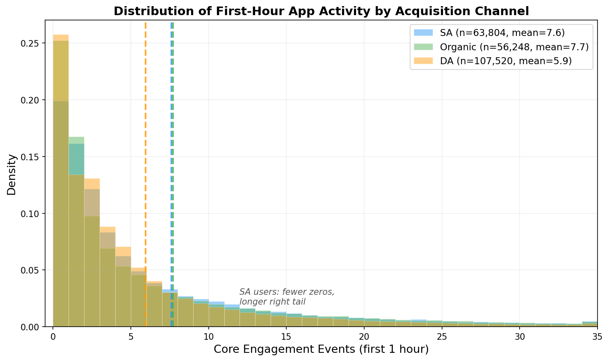

# Not So Cold: How Ad Journeys Warm Up New User Personalization

## Research Framing

> **Updated**: 2026-03-07

---

## The Story in 30 Seconds

Mobile apps spend money to acquire users, but 46% of those users permanently churn within the first week, and 24% within the first 10 minutes. More critically, **37.2% never view a single product during their first 10 minutes**. All the app knows about these users is that "they opened the app" — there is no basis for personalization since their interests are unknown, and their purchase rate is a mere 5.5%. To retain users, the app must deliver a personalized experience, but it knows nothing about new users — because there is no behavioral data.

Yet, the app already **knows something** about these users. Which ads they saw, what path they took, and how long they deliberated before installing — this **ad journey data** exists before the user ever opens the app.

We show that this data can **distinguish users with high vs. low 7-day purchase probability by a factor of 5–10x at the very moment of app install** (5.2x with the conservative linear model (Logistic Regression), 9.9x with the non-linear model (Random Forest)). We then propose an [RL (Reinforcement Learning)](#glossary) system that enables seamless personalization from the moment of install. It relies on ad journey signals at first and naturally transitions as in-app behavior accumulates.

---

<a id="glossary"></a>
## Glossary

Key concepts used throughout this document are defined here once and used in abbreviated form thereafter.

### User Classification

| Term | Definition | Example |
|------|-----------|---------|
| **SA (Search Ad) User** | A user whose last touchpoint is a Search Ad. The user actively typed a keyword in a search engine or app store and clicked on a search ad to install the app. | Searches for "[app name]" on a search engine → clicks search ad → installs |
| **DA (Display Ad) User** | A user whose last touchpoint is a Display Ad. The user clicked on a banner/video ad appearing in an Instagram feed, YouTube video, etc. | Clicks a banner ad in Instagram feed → installs |
| **Organic User** | A user who installed without any ad touchpoint. They came through friend referrals, app store browsing, news articles, etc. | Friend recommends the app → searches directly in app store → installs |

> **What does "last touchpoint (last touch) basis" mean?** A single user may encounter multiple ads. For example, if a user saw an Instagram ad (DA) and later searched on a search engine (SA) to install, this user's channel is classified as SA based on the last touchpoint.

### Churn and Purchase

| Term | Definition | Example |
|------|-----------|---------|
| **Permanent churn** | No return to the app from a certain point until 60 days post-install. "Permanent" refers to permanence within the 60-day observation window. | "Permanent churn within 10 minutes" = last activity within 10 minutes of install, no return until D60 |
| **7-day purchase rate** | The proportion of users who made at least one purchase within 7 days (168 hours) of install. Overall average is 15.5%. | A user who installed on March 1 and purchased by March 7 counts as a "7-day purchaser" |
| **Zero product.viewed users** | Users who never viewed a single product detail page during their first 10 minutes. 37.2% of all users. There is no basis for "what they are interested in" personalization for these users. | Opens app, only sees home screen and leaves, or browses categories on home screen without clicking any specific product |

### Ad Journey

| Term | Definition | Example |
|------|-----------|---------|
| **Touchpoint** | A single ad contact point the user encountered before installing the app. A click or impression. | 1 Instagram ad impression = 1 touchpoint |
| **Ad journey** | The sequence of all touchpoints a user went through before install. Recorded by the MMP. | DA impression → DA click → SA click → install (a journey of 3 touchpoints) |
| **Latency** | Time from first ad contact to install. | First saw an ad 3 days ago, installed today → latency = 3 days |
| **Recency** | Time from last touchpoint to install. | Last ad click 1 hour before install → recency = 1 hour |
| **MMP (Mobile Measurement Partner)** | A service that measures mobile app advertising performance. AppsFlyer, Adjust, Singular, etc. Records which ads a user encountered before installing. | When an app integrates an MMP, all users' pre-install ad contact history is automatically recorded |

### Models and Evaluation

| Term | Definition | Example |
|------|-----------|---------|
| **AUC (Area Under the ROC Curve)** | A score indicating how well a model distinguishes "buyers" from "non-buyers." **1.0 = perfect separation**, **0.5 = coin flip** (same as random guessing). | AUC 0.622 = when randomly picking one buyer and one non-buyer, the model assigns a higher score to the buyer 62.2% of the time |
| **Top/Bottom 10%** | A method of dividing all users into deciles by model-predicted purchase probability, then comparing the highest group (top 10%) with the lowest group (bottom 10%). | Among 380K users, the top 10% (38K) has an actual purchase rate of 26.1%, bottom 10% has 2.6% → "9.9x difference" |
| **Feature Importance** | The proportion (%) each variable contributes to prediction in a model. Higher = more important. | "Ad journey 36.6%, in-app behavior 52.8%" = 36.6% of prediction comes from ad journey, 52.8% from in-app behavior |
| **Data Leakage** | An error where information about the outcome being predicted (e.g., purchase) leaks into the predictor variables. Like "taking an exam with the answer key." | Predicting purchase with number of order.completed events — trivially accurate but meaningless → leakage |

### Model Configurations

| Model | Data Used | AUC | Description |
|-------|----------|-----|-------------|
| **Model A** (device info only) | OS, manufacturer, language, timezone, etc. 6 → 700 variables | 0.555 | Near coin-flip. Device info alone cannot distinguish |
| **Model B** (device + ad journey) | Model A + 77 ad journey variables | 0.622 | **Best available model at the moment of install** |
| **Model C** (device + ad journey + in-app aggregates) | Model B + 5 aggregated in-app 10-min variables | 0.723 | In-app behavior summarized as "total event count" etc. |
| **Model C+** (device + ad journey + in-app event decomposition) | Model B + individual in-app event type counts from 10 min | 0.744 | Granular: "product views X times, cart adds Y times" |
| **Model D** (in-app behavior only) | 5 in-app 10-min variables only | 0.703 | Powerful with in-app alone, but requires waiting 10 minutes |

> **Why is Model B the key?** Models C, C+, and D all require 10 minutes of post-install in-app behavior. But 24% of users permanently churn within those 10 minutes. **Model B is the only model that can predict at the very moment the user opens the app, without any in-app data.**

### RL (Reinforcement Learning)

| Term | Definition | Example |
|------|-----------|---------|
| **RL (Reinforcement Learning)** | An AI technique that learns optimal actions through trial and error. It accumulates experience of "in this situation, this action led to a good outcome" and makes progressively better decisions. | Showed user A a category page and they purchased → learns to show similar users category pages |
| **State** | Information the RL references at each decision point. Changes over time. | Right after install: ad journey data. After 10 min: ad journey + 10 min of in-app behavior |
| **Action** | The specific decision the RL makes. | "Should we show this user the home screen, or a specific category page?" |
| **Reward** | The objective the RL optimizes. | Purchase within 7 days of install (or revenue) |
| **MDP (Markov Decision Process)** | The mathematical structure of sequential decision-making. In the current state, choose an action → transition to next state → receive reward, repeated. | Each time a user opens the app (session), decide page → user acts → decide again at next session |

---

## 1. Limitation: Half the Users Disappear Before Generating Revenue

There is a structural problem in mobile app businesses.

Companies invest in advertising to acquire users (User Acquisition). But nearly **half of those acquired users permanently [churn](#glossary) within the first week.**

| Timepoint | Permanent Churn Rate | Meaning |
|-----------|---------------------|---------|
| 10 min | 24.0% | 1 in 4 permanently churns within 10 minutes |
| 30 min | 27.7% | |
| 1 hour | 29.4% | |
| 6 hours | 32.3% | 1 in 3 permanently churns within 6 hours |
| 1 day | 35.6% | |
| 7 days | 46.1% | Nearly half permanently churn within the first week |
| 30 days | 64.2% | 2 in 3 permanently churn within a month |

> (385,025 users observed, fraud excluded, tracked for 60 days post-install. Cohort period: 2025-01-01 to 2025-03-01 (2 months). "Permanent churn" = no return from last activity until D60)

An even more serious problem exists. **User behavior varies dramatically by acquisition channel ([SA/DA/Organic — see glossary](#glossary))** — and the direction is counterintuitive:

| Acquisition Channel | 7-Day Purchase Rate | 7-Day Churn Rate |
|--------------------|--------------------|--------------------|
| SA (Search Ad) | **18.6%** | 43.0% |
| Organic | 13.4% | 43.6% |
| DA (Display Ad) | 11.2% | **51.2%** |

> (Channel classification: last touchpoint (last touch) basis. SA = last touch is search ad, DA = last touch is display ad, Organic = no ad touchpoints at all)

Users acquired through display ads (DA) have a **lower purchase rate and 7.6pp higher churn rate** than Organic users who cost nothing to acquire. Even among ad-acquired users, SA users outperform Organic while DA users underperform Organic. **The ad channel decisively determines user quality.**

And this churn is **determined within the first few minutes.** **24.0% of all users permanently churn within 10 minutes of install**, accounting for approximately 37% of all churn that occurs by D30 — the remaining 63% is distributed across the period from 10 minutes to 30 days. Looking at cumulative churn in 30-minute intervals, the rate decelerates sharply: 10min→30min (+3.7pp)→1hr (+1.7pp)→1.5hr (+0.8pp) — most churn concentrates within the first 30 minutes. The 30-day purchase rate of users who churned within 10 minutes is **2.9%**, approximately **1/9th** of those who continued activity beyond 10 minutes (26.3%). **The first 10 minutes are effectively an irreversible inflection point.**

Looking at this inflection point more concretely: in an e-commerce app, the most critical in-app behavior is **product viewing (product.viewed)**. What products a user viewed directly reveals "what they are interested in" — the most fundamental data that personalization recommendation systems depend on.

Segmenting users by number of product views in the first 10 minutes:

| Product Views (First 10 min) | Users | User Share | 7-Day Purchase Rate | 7-Day Churn Rate |
|------------------------------|-------|-----------|--------------------|--------------------|
| **0** (never viewed a product) | 143,407 | **37.2%** | **5.5%** | **55.8%** |
| 1 | 27,621 | 7.2% | 21.5% | 40.5% |
| 2–3 | 49,458 | 12.8% | 21.6% | 38.5% |
| 4–5 | 33,571 | 8.7% | 21.5% | 37.9% |
| 6–10 | 52,866 | 13.7% | 21.3% | 36.6% |
| 11+ | 78,102 | 20.3% | 22.3% | 34.8% |

> (Computed from v2 data individual event timestamps. product.viewed = product detail page view event. All 385,025 users, fraud excluded. Among zero product view users: 47.4% had only 1 total event (app_open only), 28.6% had only home screen views (home.viewed), cart additions (addedtocart) = 0%)

**37.2% of all users never view a single product during their first 10 minutes.** Their 7-day purchase rate is 5.5%, approximately **1/4th** of users who viewed at least 1 product during the first 10 minutes (21.3%). Notably, **the jump from 0 to 1 is decisive**: the purchase rate leaps from 5.5% to 21.5% — a **3.9x** increase — but after 1 view, additional views barely change the rate (1 view: 21.5% → 11+: 22.3%). This suggests that "whether a user viewed even one product" is the inflection point separating purchase intent.

Churn rates follow the same pattern: zero product view users have a 7-day churn rate of 55.8%, **15.4pp higher** than viewing users (40.4%). The 10-month long-term churn gap is even wider (37.9% vs 15.8%, +22.1pp).

For this 37.2% of users, all the app knows is that "they opened the app." Since their interests are unknown, **existing personalization systems (collaborative filtering, content-based recommendations, etc.) have no data to work with.** And over half of these users (55.8%) leave within the first week — a "wait for in-app behavior" strategy does not work for them.

The problem is twofold: (1) to **drive purchases**, one needs to know user interests but there is no data, and (2) to **prevent churn**, one needs to identify at-risk users but this is impossible without in-app behavior. Ad journey data solves both — it can predict not only purchase probability (top/bottom 9.9x) but also churn risk (top/bottom 1.8x) **before the app is even opened.**

Therefore, a personalized first screen must be ready at the very moment the app opens — when there is zero in-app data.

The solution is clear: **provide a personalized initial experience** to reduce early churn. That personalization improves churn rates and conversion rates has been broadly demonstrated in the mobile app domain (Huang & Ascarza, 2024; Li et al., 2011). However, existing research on personalization was limited to cases where in-app behavioral data had already accumulated. And many users churn before that point.

But personalization requires information about the user. **What does the app currently know about new users?**

Only device information and install time automatically collected at install. This information cannot distinguish who will purchase:

| Information Type | Category | 7-Day Purchase Rate |
|-----------------|----------|---------------------|
| OS | Android | 14.4% |
| | iOS | 17.3% |
| Manufacturer | Samsung | 14.5% |
| | Apple | 16.4% |
| Language | Domestic (97.0%) | 15.5% |
| | English | 12.8% |
| Install Hour | 10–14h (highest) | 17.3% |
| | 02–06h (lowest) | 12.1% |

No matter which variable — OS, manufacturer, language, install hour — purchase rate differences are only 2–5pp. Even combining all these variables in a model, the ability to distinguish buyers from non-buyers ([AUC — see glossary](#glossary)) is 0.555, close to a coin flip (0.500).

Consequently, **during the first 6 hours when 32% of users leave forever, the app can only show every user the same screen.** By 7 days, this figure rises to 46%.

---

## 2. What To Do: Personalize the First Experience with Ad Journey Data

### Data That Already Exists but Goes Unused

**Before** a user installs an app, the company already possesses rich information about that user.

[MMPs](#glossary) (Mobile Measurement Partners — attribution services like AppsFlyer, Adjust, Singular) record the user's **entire pre-install [ad journey](#glossary)** and provide it to advertisers:

- **Which ad channel** they came through (search ad? display? Instagram?)
- **How many times** they encountered ads before installing (saw once and installed immediately? saw 10 times and deliberated?)
- **How quickly** they installed (1 hour after seeing the ad? a week later?)
- **Did they search for the brand** or **search for a product**?

This data is already being collected by every app, but it is **used only for user acquisition cost calculation (attribution) and then discarded.** No one uses it for post-install personalization.

### This Data Actually Distinguishes Users

We validated whether ad journey data is truly useful.

**At the moment of install**, we compared a model using only device information vs. a model that also included ad journey data. **No in-app behavioral data was used** — prediction was made simultaneously as the app was opened.

**Result: Actual purchase rates of top 10% vs. bottom 10% users as predicted by the "device + ad journey model"**

(Comparing the actual purchase rates of the top 10% the model judged as "high purchase probability" and the bottom 10% it judged as "low probability")

| Model Type | Top 10% Purchase Rate | Bottom 10% Purchase Rate | Ratio | AUC |
|-----------|----------------------|-------------------------|-------|-----|
| Random Forest (device+UA) | 26.1% | 2.6% | **9.9x** | 0.622 |
| Logistic Regression (device+UA) | 22.8% | 4.4% | **5.2x** | 0.614 |
| Device info only (RF) | 17.9% | 7.6% | 2.4x | 0.555 |
| Device info only (LR) | 17.0% | 9.5% | 1.8x | 0.555 |

> (Random Forest: non-linear ML model combining hundreds of decision trees, n_estimators=200, max_depth=10. Logistic Regression: statistical model assuming linear relationships. RF on all 385,025 users, LR on 50,000 random sample (for stable estimation with large data). Both models use 5-Fold Stratified CV predictions. Bootstrap 95% CI: RF [0.051, 0.075], LR [0.051, 0.066] — neither includes 0, **statistically confirming the AUC improvement is not by chance**. PR-AUC (stricter metric for imbalanced data): LR Device only 0.167 → Device+UA 0.201, +0.034 improvement)

**Even the most conservative linear model (LR) achieves a 5.2x top/bottom purchase rate difference, and the non-linear model (RF) achieves 9.9x.** Device info alone yields only 1.8–2.4x. Regardless of model choice, adding ad journey dramatically improves user discrimination. The difference between the two models stems from the non-linear model's ability to capture interaction effects (latency × channel, OS × channel, etc.). That even the conservative linear model achieves 5.2x separation confirms that ad journey's predictive power is a robust result independent of model choice.

This result is not limited to purchase. As shown earlier, the 37.2% of zero product view users have an extreme churn rate of 55.8%. **Ad journey data can predict this churn as well:**

**Result: Actual churn rates of top 10% vs. bottom 10% users as predicted by the "device + ad journey model"**

(Comparing actual 7-day churn rates of the top 10% the model judged as "high churn probability" and the bottom 10% it judged as "low probability")

| Model Type | Top 10% Churn Rate | Bottom 10% Churn Rate | Ratio | AUC |
|-----------|-------------------|----------------------|-------|-----|
| Random Forest (device+UA) | 65.3% | 35.3% | **1.9x** | 0.598 |
| Logistic Regression (device+UA) | 63.7% | 37.9% | **1.7x** | 0.590 |
| Device info only (RF) | 61.7% | 38.4% | 1.6x | 0.568 |
| Device info only (LR) | 61.4% | 38.5% | 1.6x | 0.570 |

> (Same setup: RF all 385,025 users, LR 50,000 sample, 5-Fold Stratified CV. The churn prediction ratio (1.9x) is smaller than purchase (9.9x) because the base churn rate is 46.1%, compressing the distribution. However, the **absolute difference (65.3% vs 35.3% = 30pp)** is practically very meaningful)

The churn prediction ratio (1.9x) appears smaller than purchase (9.9x), but this is because the base churn rate is 46.1%. The key is the **absolute value**: the actual churn rate of the top 10% flagged as "high churn risk" is 65.3%, **30pp higher** than the bottom 10% "low risk" (35.3%). These users overlap heavily with zero product view users (55.8% churn rate), and **being able to identify "users likely to leave" before the app is even opened** means those users can receive a different experience from the first screen.

Synthesizing both predictions:

| Prediction Target | Device Only (AUC) | Device+UA (AUC) | UA Lift | Top/Bottom 10% Difference (RF) |
|-------------------|------------------|----------------|---------|-------------------------------|
| 7-Day Purchase | 0.555 | **0.622** | +0.067 | **9.9x** (26.1% vs 2.6%) |
| 7-Day Churn | 0.568 | **0.598** | +0.030 | **1.9x** (65.3% vs 35.3%) |
| 7-Day Spending | 0.062 | **0.118** | +0.055 | **9.8x** ($45 vs $5) |

> (Purchase/Churn: AUC, Spending: Spearman r. RF basis. Conservative comparison: LR also shows purchase 5.2x/churn 1.7x, consistent direction and significance)

Ad journeys distinguish not only "who will buy" but also "who will leave" and "how much they will spend" before install. This pattern holds consistently when extended to D14 and D30 (detailed analysis in Appendix "Multi-Target Prediction").

Furthermore, analyzing purchase details (order amount, product category, repeat purchase) reveals that ad journeys **systematically distinguish not just whether someone purchases, but the "quality" of the purchase:**

| Acquisition Channel (last-touch) | Avg Revenue per Buyer (D30) | AOV | Purchase Categories | Repeat Purchase Rate |
|--------------------------------|---------------------------|-----|--------------------|--------------------|
| SA (Search Ad) | **$248** | **$131** | **2.59** | **38.1%** |
| Organic | $194 | $98 | 2.62 | 37.0% |
| DA (Display Ad) | $181 | $98 | 2.39 | 34.5% |

> (SA vs DA all metrics statistically significant: revenue p=4.83e-87, AOV p=7.46e-89, orders p=2.91e-10, categories p=7.78e-16. Mann-Whitney U test)

**SA users don't simply "buy more" — they spend 37% more, buy 34% more expensive products, purchase across more diverse categories, and have higher repeat purchase rates.** This means the qualitative difference in purchase intent reflected by ad journeys translates into qualitative differences in actual purchase behavior. If the RL system's reward function is designed around actual revenue (LTV) rather than binary purchase (0/1), these qualitative differences can be optimized.

### Distinguishing Prediction from Causation

An important distinction is necessary before interpreting the results above. This research **clearly separates prediction and causation** in the use of ad journey data.

- **Prediction problem (core of this research)**: "Is this user likely to purchase?" — We demonstrate that ad journey data provides meaningful information for this prediction. Whether ad journeys **directly cause** purchases is not important here. It is sufficient that they **reflect** the user's prior intent. Whether ad platform targeting algorithms show more ads to high-probability purchasers, or users voluntarily search, the fact that ad journeys are an effective signal for distinguishing purchase probability remains unchanged.

- **Causal question (partially verified via PSM, full verification via field experiment planned)**: "Does a personalized first experience actually increase purchases?" — This is a separate causal question. We provide partial evidence through observational PSM, but final confirmation should come from A/B testing.

Why this distinction matters: channel effects (SA > DA) may include **selection bias** — SA users may inherently have higher purchase intent, which is why they came through the SA channel. This is problematic for causal inference but **not for prediction purposes**. What the RL system needs is the ability to distinguish "what type of user this is," not "whether the ad changed this user."

### What Exactly Does the Ad Journey Distinguish?

Let's look intuitively at how the model internally distinguishes users.

**Channel type**: Even among "ad-acquired users," behavior varies completely depending on which ad they came through.

| Acquisition Channel (last-touch) | 7-Day Purchase Rate | 7-Day Churn Rate | First-Hour Core Events |
|--------------------------------|--------------------|--------------------|------------------------|
| SA (Search Ad) | **18.6%** | 43.0% | **7.84** (+29%) |
| Organic | 13.4% | 43.6% | 7.72 |
| DA (Display Ad) | 11.2% | **51.2%** | 6.08 (baseline) |

> (Last-touch classification. "Core events" = average count of key in-app events (product.viewed, page_view, home.viewed) during the first hour post-install. SA vs DA difference is statistically fully significant (Mann-Whitney U test, p ≈ 0))

Search ad (SA) users actively searched for a brand name or product name and clicked a search ad to install. Among SA users, brand search users have a 7-day purchase rate of 25.3%, and product search users 22.5%. They generate an average of 7.84 core events in the first hour. Display ad (DA) users clicked a banner ad in a social media feed. In the same period, they generated 6.08 events — **29% less** activity. Organic users interestingly have in-app activity (7.72) close to SA (7.84), but lower purchase conversion than SA.

**Channel order also matters.** Analyzing touchpoint sequences reveals that **even when experiencing the same channels, the order matters:**

| Journey Type | Users | 7-Day Purchase Rate | 7-Day Churn Rate |
|-------------|-------|--------------------|--------------------|
| SA→DA (search first, then retargeting) | 9,534 (2.5%) | **21.7%** | **39.9%** |
| DA→SA (ad first, then direct search) | 11,499 (3.0%) | 18.9% | 42.0% |
| Repeated SA | 4,986 (1.3%) | **24.9%** | 44.4% |
| Repeated DA | 21,540 (5.6%) | **7.2%** | **55.4%** |

> (Journey type classification: based on the channel type (SA/DA) order of the **entire pre-install touchpoint sequence**. Not last-touch based — e.g., SA→DA = "all users where an SA touch occurred before a DA touch," including all with 2+ touches (avg touches: SA→DA 17.6, DA→SA 27.3). "Repeated SA/DA" = 2+ touches of that type only)

SA→DA (search then retargeting) and DA→SA (ad then search) **both experienced SA and DA**, but the order produces a **2.8pp difference** in purchase rate (21.7% vs 18.9%). Users who first showed intent through search and then reconfirmed via display ads have higher purchase rates than those who first saw an ad and later searched. Repeated DA (display only, multiple exposures) shows the lowest purchase rate at 7.2% and highest churn at 55.4% — users exposed to ads repeatedly without search have weak install intent.



> The distribution above compares per-user first-hour core event count (core_engagement) by channel. DA (orange) is most concentrated near 0 (zero rate: DA=25.1%, SA=19.1%), while SA (blue) has the longest right tail. Even after the same 1 hour, **the amount of in-app data accumulated differs by channel** — this is why a static rule of "transitioning all users at the same time with the same weight" fails.

Purchase rate differs by 1.66x, churn rate by 8.2pp. Showing the same first screen to all three groups is irrational.

**Search keyword intent**: Whether a search term exists at ad click, and **what was searched**, is also a powerful signal.

| Search Intent | 7-Day Purchase Rate | vs No-Keyword Users |
|--------------|--------------------|--------------------|
| Brand search (e.g., "[app name]") | **25.3%** | 1.70x |
| Product search (e.g., "[product category]") | **22.5%** | 1.51x |
| Promo search (e.g., "[app name] discount") | **32.3%** | 2.17x |
| No keyword | 14.9% | baseline |

> ("No keyword" = users with no search term recorded at ad click. Includes SA users with missing keywords, DA users, and Organic users (approx. 94% of total). Users with keywords are approx. 5.8%, primarily SA (search ad) users)

Promo search users have a purchase rate of 32.3%, **more than double** that of no-keyword users. Knowing "what this user searched for" alone could dramatically increase first-screen personalization precision.

Beyond these, the model uses a total of 77 ad journey variables. Key variables by type:

- **Channel information**: Whether last touch is search ad/display, keyword possession, unique channel count, channel diversity (how distributed across different channels)
- **Temporal information**: Time from first ad contact to install (latency), time from last contact to install (recency), total ad journey duration (touch window)
- **Behavioral density**: Total touch count, click/impression ratio, touches within last 30min/1hr/24hr before install, touches per hour
- **Interaction patterns**: Single-touch install indicator, first/last touch type (click vs impression), proportion of touches in last 24 hours

These variables combine to enable the model to distinguish top/bottom 10% by 5–10x.

### At the Moment of Install, the Ad Journey Is the Only Data Available

A user has just opened the app for the first time. We need to decide what to show them. **What do we currently know about this user?**

In-app behavioral data? **None.** They haven't done anything yet.

Device information? We know if they're on Android or iOS. But Android users' 7-day purchase rate is 14.4%, iOS is 17.3% — **virtually no difference.** Same for manufacturer, language, timezone. Device info cannot distinguish buyers from non-buyers (AUC 0.555, nearly identical to random 0.500).

**The ad journey is the only data source.** Which ads this user saw, whether they searched, how quickly they installed — this is the only meaningful data available at the moment of install.

And as time passes, in-app behavior begins to accumulate. After 10 minutes, a few clicks; after 1 hour, product views and searches; after 6 hours, substantial behavioral data. Naturally, in-app behavior becomes better information, and the ad journey's role diminishes.

We confirmed this with numbers. We predicted **"Will this user purchase within 7 days?"** but varied the prediction timepoint, using **only data accumulated up to that point.** For example, the "10 minutes post-install" row used device info + ad journey (77 variables) + **10 minutes of in-app behavior (5 key variables)** only to predict 7-day purchase (Random Forest feature importance):

| Prediction Timepoint | Data Used | Device Info | Ad Journey | In-App Behavior |
|---------------------|----------|------------|-----------|----------------|
| **10 min post-install** | Device + ad journey + 10 min in-app | 10.6% | **36.6%** | 52.8% |
| 30 min post-install | Device + ad journey + 30 min in-app | 9.5% | 32.1% | 58.4% |
| 1 hour post-install | Device + ad journey + 1 hr in-app | 9.0% | 30.1% | 60.9% |
| 1.5 hours post-install | Device + ad journey + 1.5 hr in-app | 8.3% | 28.1% | 63.5% |
| 2 hours post-install | Device + ad journey + 2 hr in-app | 8.2% | 28.1% | 63.7% |
| 3 hours post-install | Device + ad journey + 3 hr in-app | 8.2% | 28.1% | 63.8% |
| 6 hours post-install | Device + ad journey + 6 hr in-app | 7.7% | 25.8% | 66.4% |
| 1 day post-install | Device + ad journey + 1 day in-app | 6.6% | 22.9% | 70.6% |

> (Random Forest [feature importance](#glossary) (each variable's contribution to prediction), n_estimators=200, max_depth=10, all 385,025 users. Purchase-related event count (purchase_engagement) excluded to avoid circular logic ([data leakage — see glossary](#glossary)) of "predicting purchase with purchase data," using an adjusted value (adjusted_totalEventCount) with purchase events subtracted. In-app features: active, ad_engagement, core_engagement, deeplink_count, open_count, adjusted_totalEventCount)

**What this table shows is that the optimal weighting continuously changes over time.**

Right after install, 10 minutes of in-app behavior accounts for 52.8% of predictive power, but this 10 minutes of behavior is only **available after** 10 minutes have passed — and during those 10 minutes, 24.0% of users have already permanently churned. In contrast, ad journey data (**36.6%**) and device info (10.6%) are **already secured the moment the user opens the app, making them the only meaningful signals for immediate** personalization. At the 10-minute mark, ad journey is about 2/3 the level of in-app behavior, but at the very first moment when no in-app data exists, it is the only available predictor. Over time, as in-app behavior accumulates, the ad journey's weight naturally decreases: 30.1% at 1 hour, 25.8% at 6 hours, 22.9% at 1 day.

We also confirmed this decay through **model performance (AUC)**. The value of ad journeys varies dramatically depending on whether in-app data exists ([see glossary for model configurations](#glossary)):

| Comparison | AUC | Meaning |
|-----------|-----|---------|
| A: Device info only | 0.555 | Baseline (coin-flip level) |
| B: Device + ad journey | **0.622 (+0.067)** | Ad journey is key when no in-app data |
| D: In-app 10 min only | 0.703 (+0.148) | In-app alone is powerful |
| C: Device + ad journey + in-app 10 min (aggregated) | 0.723 (+0.168) | All information combined (5 aggregated features) |
| **C+: Device + ad journey + in-app 10 min (event decomposition)** | **0.744 (+0.189)** | **+0.021 additional improvement from event decomposition** |

> Model C summarizes 10 min in-app behavior into 5 aggregate variables (active, core_engagement, deeplink_count, open_count, adjusted_totalEventCount). Model C+ decomposes the same 10-min behavior into **individual event type counts** (product.viewed, addedtocart, signin, etc. — 9 leakage-safe out of 36 event types). This decomposition improved AUC from 0.723 to **0.744 (+0.021)**, and the top/bottom 10% purchase rate gap widened from 24.2x to **30.1x** (top 10%: 36.4% → **41.3%**). The most powerful individual event signal is **cart addition (addedtocart)**: users who added to cart within the first 10 min have a 7-day purchase rate of **40.4%** (vs 9.4% for non-adders, **4.3x**) — an extremely powerful behavioral signal invisible in aggregate values. This variable corresponds to exploratory behavior unlike purchase events (order.completed), so it is not data leakage.

That early in-app behavior predicts long-term outcomes is not itself a new finding. In the gaming industry, it is already known that the first session alone can predict retention (Drachen et al. 2016; Hadiji et al. 2014), and Huang & Ascarza (2024, Marketing Science) showed that short-term behavioral signals enable long-term targeting. Model D (AUC 0.703 with in-app 10 min only) is consistent with these prior results.

**The problem is that one must "wait" for that data.** Getting 10 minutes of in-app data requires waiting 10 minutes, during which 24% of users permanently churn. Churned users generate no in-app data, so in-app-based personalization is fundamentally impossible for the users who need it most.

**The value of ad journeys lies precisely in filling this information vacuum:**

- **When there is no in-app data** (moment of install): Device alone yields AUC 0.555 (coin-flip level). Adding ad journey yields **0.622 (+0.067)** — this is the core value.
- **After in-app data exists** (10 min later): In-app alone yields AUC 0.703. Adding ad journey yields 0.723 (+0.020). Applying event decomposition further yields **0.744 (+0.041)** — in-app dominates, but event-level precise behavioral signals add value.

In other words, ad journeys are not an "auxiliary" to in-app data, but the **"only meaningful signal at the moment when in-app data does not exist."** And this moment is precisely when user churn occurs fastest — the highest-leverage point for personalization.

This structure creates an **information transition over time**. As confirmed in the feature importance table above, the relative contribution of ad journeys systematically decays over time (10 min: 36.6% → 1 hr: 30.1% → 6 hr: 25.8% → 1 day: 22.9%). This is because as in-app behavior accumulates, ad journey information is gradually absorbed by in-app behavior.

### Theoretical Background

This information transition structure is interpreted through three theoretical lenses.

**First, the Bayesian Learning framework.** A firm's uncertainty about a user diminishes over time as new information arrives (Erdem & Keane 1996; Shin, Misra & Horsky 2012). The ad journey up to install forms a **prior**, and in-app behavior updates it to a **posterior**. Our feature importance decay pattern (UA: 36.6% → 22.9%) is an empirical demonstration of this Bayesian updating process — the weight of the prior (ad journey) naturally decreases as new data (in-app behavior) accumulates.

**Second, goal-directed vs. exploratory browsing (Moe 2003, JMR).** SA users are **goal-directed browsers** who actively searched for a specific need, while DA users are closer to **exploratory browsers** who happened to encounter an ad in a social media feed. As Moe (2003) showed, goal-directed browsers have higher conversion rates, while exploratory browsers tend to remain in the information-gathering stage. In our data, SA users' purchase rate being 1.66x higher than DA and their core event count being 29% higher precisely aligns with this theory.

**Third, Expectation-Confirmation Theory (Oliver 1980; Bhattacherjee 2001).** Users form **expectations** about an app through ads, and when post-install experience matches these expectations, it leads to satisfaction and continued use. The high purchase rate of brand search users (25.3%) reflects clear expectations upon arrival, while the high churn rate of repeated DA users (55.4%) reflects vague expectations. A personalized first experience is a mechanism that increases expectation-experience alignment to reduce early churn.

The convergence point of these three theories is our core argument: **Ad journeys are signals reflecting users' prior intent, and personalization leveraging these signals increases expectation-experience alignment, accelerating in-app behavior accumulation, which in turn leads to progressively more accurate personalization through Bayesian updating — creating a virtuous cycle.** And this dynamic transition structure is exactly why RL — not a static model — is needed.

---

## 3. How To Make More Money: Seamless Personalization from Install

### Ultimate Goal

**Increase the first conversion rate within 7 days of install.** This research defines purchase as conversion, but the definition can be substituted with subscriptions, bookings, content consumption, etc., depending on app type. The rationale for the 7-day benchmark is clear from the data: **74.4% of users who convert by D30 have already converted within the first 7 days, and only 6.3% of users who don't convert by D7 convert by D30.**

To achieve this, we propose an **[RL (Reinforcement Learning)](#glossary) system that shows each user the most suitable page every time they open the app.** The RL's **performance metric (reward) is purchase within 7 days of install**, but the **system itself operates continuously from the moment of install** — making an optimal page decision every time the user opens the app. The same system can be extended to optimize D14 and D30 purchases beyond 7 days. However, this research establishes and validates 7-day post-install as the core metric.

### Concrete Decisions a Manager Can Make

"A new user has opened the app. **Which page should we show them?**"

This question arises hundreds of thousands of times daily. Currently, all new users see the same home screen. Our system automates and personalizes this decision per user.

```
[User A installs the app for the first time] — RL starts operating immediately

  RL knows: Ad journey data (channel, latency, touch count...)
  RL doesn't know: What this user likes (no in-app behavior yet)

  RL's judgment: "A user who searched for a specific product via search ad.
                  High purchase intent. Send to that category."
  → Routes to bestseller page for that category


[Same user reopens the app 3 hours later] — RL still operating

  RL knows: Ad journey + "they explored a different category earlier"

  RL's judgment: "Interested in a different category than initial entry.
                  In-app behavior is emerging, increase its weight."
  → Routes to curated page for the explored category


[Same user reopens the app 3 days later] — RL still operating

  RL knows: Ad journey + 3 days of in-app behavior (wishlist, cart, view history)

  RL's judgment: "Sufficient in-app data accumulated.
                  In-app data is now far more accurate than ad journey."
  → Routes to personalized page based on cart/wishlist
```

The key: **RL runs continuously from start to finish.** Only the weight of information it references changes over time.

- Right after install: Heavily relies on ad journey (no other information available)
- Over time: As in-app behavior accumulates, naturally reduces ad journey weight
- After a few days: Nearly 100% in-app behavior based — same as conventional personalization

### Why RL

As confirmed earlier, the optimal weighting between ad journey and in-app behavior continuously changes over time (10 min: 36.6% → 1 hr: 30.1% → 1 day: 22.9%). There are three reasons why this weighting cannot be predetermined with fixed rules.

**First, ad journey signal reliability and validity period differs by user type.** SA users accumulate in-app data quickly (zero activity 19.1%), while DA users do so slowly (25.1%). Even after the same 10 minutes, SA users' core events average 7.84 vs. DA's 6.08 — a 29% difference. High-activity users can quickly reduce ad journey weight, while low-activity users must rely on ad journey signals longer. A fixed rule of "37% ad journey weight at 10 minutes post-install" is not optimal for individual users.

**Second, variable relationships are non-linear and direction varies by channel.** Take latency (time from ad exposure to install) as an example:

| Latency Range | 7-Day Churn Rate | 7-Day Purchase Rate |
|--------------|------------------|--------------------|
| <1 hour (immediate install) | **50.9%** | 17.0% |
| 1–15 hours | 47.4% | 14.1% |
| 15–23 hours | 45.0% | 15.6% |
| **23–24 hours** | **42.6%** | **16.3%** |
| 24+ hours | 47.4% | 15.8% |

Immediate installers have the highest churn rate (50.9%), while users who deliberated for about a day have the lowest (42.6%). Moreover, **the purchase rate pattern reverses by channel for the same latency:**

| Channel × Latency | <1 hour (7-Day Purchase Rate) | 1–24 hours (7-Day Purchase Rate) | 24+ hours (7-Day Purchase Rate) |
|-------------------|-------|-------|--------|
| DA (Display) | 12.8% | **9.3%** (lowest) | 14.0% |
| SA (Search Ad) | 15.9% | 19.1% | **22.5%** (highest) |

DA users show a U-shape, SA users show monotonic increase — the direction itself differs by channel. Additionally, OS × channel cross effects show Android × DA (purchase rate 9.4%) vs iOS × SA (25.0%) — a **2.66x** gap, and key predictive variables differ by channel (recency ranks #1 for DA, SA_count ranks #1 for SA). No single rule like "longer latency is better/worse" can be established.

**Third, static alternatives that reviewers might suggest all have limitations.**

- **"Fixed weight rule"**: Fixing "ad journey 37%, in-app 53%" means in-app weight is too high right after install (only 10 minutes of in-app data actually exists), and ad journey weight is too high after 1 day.
- **"Time-based model switching"**: Use UA model at t=0, switch to in-app model at t=10 min. But the optimal switching point varies per user.
- **"Channel-segmented models"**: Building separate models for SA/DA/Organic still faces the problem that prediction structure varies completely within channels by latency, touch count, and OS, and sub-segmentation reduces sample sizes making models unstable.

The fundamental reason these three alternatives fail: "information sets that change over time" + "different optimal transition speeds by user type" + "circular structure where actions determine future states" all coexist. RL automatically learns all these cases from data. **"For this user, at this moment, which page maximizes the probability of purchase within 7 days of install?"** — this is optimized at every app open.

### Operating Mechanism

```
Install ──→ RL starts ──→ RL continues ──→ RL continues ──→ Purchase!
         (ad journey based) (transitioning)   (in-app based)

Time:     Right after install   ~1 hour later      ~1 day later
Refs:   Ad journey 36.6%    Ad journey 30.1%    Ad journey 22.9%
        In-app 52.8%         In-app 60.9%        In-app 70.6%
```

### RL Prerequisite: Does MDP Structure Actually Exist in the Data?

For RL to work, user behavior must exhibit a sequential decision-making ([MDP — see glossary](#glossary)) structure: (1) multiple decision opportunities (sessions) exist over time, (2) user state changes over time (state transitions), and (3) previous actions influence future states. We verified through individual event timestamps that this structure actually exists:

**1. Multi-session structure**: Within 7 days of install, **69.8% of users have 2+ sessions**. Average 5.4 sessions, median inter-session gap 1.1 hours. Most users reopen the app multiple times, and each app open becomes an RL decision point.

**2. State transitions exist**: Among users with 2+ sessions, **75.0% exhibit new event types in subsequent sessions** — a user who only viewed products in the first session later shows search, wishlist, cart addition, and other new behaviors. User state actually changes over time.

**3. Rich state space**: 36 event types are confirmed in the data. Even the 9 leakage-safe behavioral events alone (product.viewed, addedtocart, signin, signup, wishlist, page_view, home.viewed, deeplink_open, app_open) can sufficiently represent user behavioral states.

**4. Decision opportunities**: The presence of deeplink_open events shows that users revisit the app through various entry paths (notifications, deeplinks, etc.). When landing page data becomes available, the page shown at each revisit can be defined as the RL action.

> (All 385,025 users, session separation based on app_open events)

All four conditions are met, confirming that **our data actually supports the MDP structure of the RL framework.** This confirms that the RL proposal is not a purely theoretical argument but an empirical proposal supported by data structure.

### Ad Journey → 7-Day Purchase: Causal Mechanism

Ad journey data does not **directly** increase 7-day post-install purchases. The mechanism is indirect and forms a virtuous cycle:

```
① Personalize first experience with ad journey
   (Based on ad journey data, RL selects the most suitable landing page for this user)
        ↓
② User stays instead of churning
   (A user who would have left quickly seeing an irrelevant home screen
    now spends time viewing relevant products)
        ↓
③ In-app behavioral data accumulates
   (Clicks, views, searches, wishlist — data revealing what this user likes)
        ↓
④ RL personalizes with increasing accuracy
   (As in-app data accumulates, RL shifts weight from ad journey → in-app behavior,
    improving recommendation accuracy)
        ↓
⑤ Purchase within 7 days of install
```

**The key is step ②.** What ad journeys do is not directly predicting "this user will purchase." The role of ad journeys is to **prevent early churn, pushing more users into the personalization funnel.** Specifically:

- Currently, of 100 installers, 32 leave forever within 6 hours (46 by 7 days)
- Only the remaining 68 accumulate in-app behavior, and a subset converts to purchasers
- If ad journey-based personalization reduces early churn by even 10pp (32% → 22%), **users remaining in the funnel increase from 68 to 78** — a 15% increase
- These additional 10 users generate in-app data, RL personalizes more accurately, and some of them purchase

They must stay for in-app data to accumulate, in-app data must accumulate for accurate personalization, and that leads to purchases. **The ad journey is the starting point of this virtuous cycle.**

Without ad journeys? The only reference for RL is device info, whose predictive power is essentially coin-flip level (AUC 0.555, random = 0.500). It's virtually the same as recommending blind. While recommending blind, 32% of users permanently churn within 6 hours (46% by 7 days) — then no matter how good the subsequent personalization system is, **many users are already lost.**

---

## 4. Why This Research Matters

### For Managers

1. **Immediately actionable**: Every app already collects this data through MMPs. Implementation is possible with existing infrastructure, no additional data collection needed.

2. **Enables concrete decisions**: Automates and personalizes the decision of "which page to show new users" — a decision that occurs hundreds of thousands of times daily.

3. **Quantifiable in monetary terms**: Estimated from this app's actual data:

   ```
   Monthly new installs:      ~192,500
   Current D7 churn:          46.1% → ~88,700/month leave forever within 7 days
   Paid user share:           85.4% → monthly UA spend ~$363K (assuming ~$2.2/install)
   D7 churn share of UA:     ~$170K/month wasted on users who churn within 7 days
   ```

   **Conservative scenario: If personalization reduces D7 churn by just 5pp** (46.1% → 41.1%):

   | Metric | Value |
   |--------|-------|
   | Additional retained users | **~9,600/month** |
   | Purchase conversions (15.4% rate applied) | **~1,480/month** |
   | Additional revenue (avg D30 LTV ~$185/buyer) | **~$274K/month** |
   | **Annual additional revenue** | **~$3.3M** |

   > (Assumption: additional retained users have the same purchase rate as the overall average. In reality, near-churn users may have below-average purchase rates, making this a conservative estimate. CAC ~$2.2 is average for e-commerce apps in the market. Exchange rate ₩1,350/$1)

   This estimate illustrates the **order of magnitude** of the personalization effect. Why a 5pp churn reduction is a reasonable target: currently all new users see the same home screen, and if ad journeys can distinguish top/bottom users by 5–10x, at minimum, tailored responses for the highest churn-risk groups are feasible.

### For Academics

**Core Contribution (Single Contribution Statement)**: This research fills the mobile app cold-start information vacuum with MMP ad journey data, empirically demonstrates the structure where information sources dynamically transition from install moment to in-app behavior accumulation, and proposes an RL-based seamless personalization framework leveraging this structure.

1. **RL in an environment where information sources transition**: Existing marketing RL research (Ma et al. 2025) optimizes actions with fixed information sources. In our problem, **the information source itself qualitatively changes over time** — at t=0 only ad journey, from t=10 min in-app is added, by t=1 day in-app dominates. We propose an RL framework that simultaneously optimizes actions and information weighting in this non-stationary information structure. Additionally, the RL action (first landing page) determines future state (in-app behavior) — a **circular structure** where today's personalization creates tomorrow's data — which is impossible to capture with static models.

2. **Empirical demonstration of cold-start information vacuum**: The predictive power of very early in-app behavior is already known (Drachen et al. 2016; Hadiji et al. 2014; Huang & Ascarza 2024). Our finding is that **24% churn while waiting for that data** — more precisely, 37.2% never view a single product in the first 10 minutes (their subsequent purchase rate is only 5.5%) — and that ad journey data is the only signal filling this information vacuum (AUC +0.067, top/bottom 10% 5–10x). This temporal decay structure (36.6% → 22.9%) has never been documented. Furthermore, ad journeys distinguish not just purchase occurrence but purchase **quality** (SA users' revenue 37% higher than DA, p<0.001), providing a basis for designing the RL reward function around actual revenue rather than binary purchase.

3. **Academic use of a new data source**: MMP multitouch data generates billions of records annually in industry, but has virtually never been utilized in marketing academic literature — existing research primarily relies on internal CRM, web clickstream, or experimental data. Padilla, Ascarza & Netzer (2025) presented the information value of customer journey data as the closest prior work, but no research has directly utilized MMP multitouch attribution data (channel-specific touchpoint sequences, latency, creative metadata, etc.). We empirically demonstrate that this data provides meaningful signals for cold-start personalization and present a framework for using it as initial state in the RL system.

### vs. Existing Literature

| Existing Research | Key Content | How This Research Differs |
|------------------|------------|--------------------------|
| **Ma, Huang, Ascarza & Israeli (2025, R&R at Marketing Science)** | RL-based multi-signal dynamic personalization | Our methodological foundation. They optimize actions with **fixed** information sources. We introduce a structure where **information sources themselves transition over time** |
| **Padilla, Ascarza & Netzer (2025, QME)** | Customer journey as information source for customer management | Closest prior work. They demonstrated journey data's information value but stopped at "prediction." We connect prediction to **action (personalization)** and **dynamic optimization** via RL |
| Huang & Ascarza (2024, Marketing Science) | Short-term in-app signals for long-term targeting | Their "short-term signals" are early in-app behavior — **after data exists**. We start one step earlier, at **the moment of install when no behavioral data exists** |
| Rafieian (2023, Marketing Science) | RL-based mobile ad sequence optimization | Optimizes ad **exposure sequence**. We optimize **post-install** in-app experience — complementary relationship |
| Liu (2023, Marketing Science) | Batch deep RL for coupon personalization | RL for existing users. We target **new users (cold-start)** with added information source transition structure |
| Drachen et al. (2016, AIIDE); Hadiji et al. (2014, IEEE CIG) | First session/day behavior predicts retention/churn | Prediction **after in-app behavior is collected**. We leverage ad journey signals **before** in-app behavior and model the **dynamic transition** as in-app data accumulates |
| Ascarza (2018, JMR) | Churn prediction-based targeting can be ineffective | Requires in-app behavioral data. We solve the problem of **the install moment when no behavioral data exists** |
| Lemmens et al. (2025, IJRM) | Review of personalization in customer management | Identifies cold-start as a key unsolved challenge. We directly address this gap with MMP data |

---

## 5. Limitations and Future Work

We explicitly state this research's limitations and future directions.

**1. Causal Inference Limitations with Observational Data**

Current analysis is based on observational data. PSM partially verified the causal effect of first 10 minutes of activity (96% of gap maintained after matching), but unobserved variables (e.g., user's immediate purchase need, high intent from referrals) cannot be completely ruled out. **A field experiment (A/B test: random landing page assignment → observe purchase change) is essential for final RL system effectiveness verification.** This is the core of the next research phase.

**2. Single App, Single Cohort Data**

The analysis covers a single home interior e-commerce app, with a cohort period of January–February 2025 (approximately 2 months). To confirm external validity (generalizability): (1) replication across different categories (gaming, finance, food, etc.) and regions, and (2) different time periods (seasonality, promotional effects) are needed. However, since MMP data structure (channels, latency, touch counts, etc.) is identical across all apps, the framework itself is universally applicable.

**3. Endogeneity of Channel Effects (Selection vs Treatment)**

SA users' higher purchase rate (18.6% vs DA 11.2%) may include **selection bias** — users with inherently higher purchase intent may come through the SA channel, meaning the channel does not "cause" purchases but "reflects" pre-existing intent. Additionally, ad platform targeting algorithms exposing more ads to high-purchase-probability users create **reverse causation**. However, the core of this research is **prediction**, not causal inference: whether ad journeys reflect user prior intent or provide independent signals, the conclusion that they are effective predictors for personalization remains unaffected (detailed discussion in Section 1 "Distinguishing Prediction from Causation").

**4. Absolute Level of Predictive Power**

The ad journey AUC lift (+0.067) is statistically significant and practically meaningful, but the absolute AUC (0.622) is not high enough to call "precise prediction." This is an inherent limitation of the cold-start problem — perfectly predicting long-term behavior from pre-install data alone is impossible. However, the core contribution is not "perfect prediction" but **securing a meaningful signal at a point where there was zero information.** The improvement from AUC 0.555 (coin flip) to 0.622 translates into practical value of distinguishing top/bottom users by 5–10x.

**5. Creative Data Coverage**

Only 4.1% of all users (15,955) have analyzable ad creative data. Technical improvements exist to expand this coverage to up to 33.4%, and personalization precision could be further enhanced with future data expansion.

**6. RL System Implementation Not Yet Validated**

This research is at the stage of **proposing and justifying** the RL framework. Actual RL training, simulation, and deployment will be conducted in future research. The current-stage contributions are (1) empirical demonstration of cold-start information vacuum, (2) validation of ad journey information value, (3) documentation of temporal information transition structure, **(4) confirmation of MDP structure in the data** (69.8% have 2+ sessions, 75% show state transitions) — these four provide the empirical foundation justifying the RL framework.

**7. Limited Incremental Predictive Power of Touchpoint Sequences**

When individual touchpoint sequences (journey order, first touch type, SA+DA crossover, etc.) were added as features, the AUC improvement for install-time prediction (without in-app data) was **+0.000**. Aggregate variables (SA_count, DA_count, total_touch_count, etc.) already capture most of the sequence's predictive information. However, this does not mean "order doesn't matter": the SA→DA vs DA→SA purchase rate difference (21.7% vs 18.9%) is statistically significant, and order effects make important contributions to **interpretation and mechanism understanding**. That the prediction model already captures this information indirectly through aggregate variables does not negate the importance of order itself.

**8. Landing Page Data Not Yet Available**

Defining the RL system's action space (which page to show) concretely requires actual landing page data. This information is not yet available in current data. The presence of deeplink_open events suggests various entry paths exist, but specific page types and frequencies require analysis after future data acquisition.

---

## 6. One-Line Pitch

> **Existing personalization could only start after in-app behavior accumulated. But apps already know which ads users saw before arriving. By advancing the personalization start point to the moment of install, we can retain and convert more of the new users — 37.2% of whom never view a single product in the first 10 minutes (with a purchase rate of only 5.5%) and 46% of whom permanently churn within the first week. Ad journey data alone distinguishes top/bottom 10% user purchase rates by 5–10x (5.2x linear model, 9.9x non-linear model), search ad users have 1.66x higher purchase rates and 37% higher revenue than display ad users. By conservative estimate, if this personalization reduces 7-day churn by just 5pp, it generates ~$3.3M in additional annual revenue.**

---

## Appendix: Key Numbers

| Metric | Value | Meaning |
|--------|-------|---------|
| Users analyzed | 385,025 | Partner mobile app (home interior e-commerce), fraud excluded |
| 10-min permanent churn rate | 24.0% | 1 in 4 leaves forever within 10 minutes |
| 6-hour permanent churn rate | 32.3% | 1 in 3 leaves forever within 6 hours |
| 7-day permanent churn rate | 46.1% | Nearly half leave forever within the first week |
| 30-day permanent churn rate | 64.2% | 2 in 3 leave forever within a month |
| DA vs Organic 7-day churn rate | 51.2% vs 43.6% | Paid users churn more than free ones |
| SA vs DA 7-day purchase rate | 18.6% vs 11.2% | Channel alone yields 1.66x difference |
| Android×DA vs iOS×SA 7-day purchase rate | 9.4% vs 25.0% | Cross effect 2.66x |
| Ad journey top/bottom 10% 7-day purchase rate difference | **5.2x** (LR) ~ **9.9x** (RF) | Distinguishable before app opens |
| Search keyword users 7-day purchase rate | 25.3% vs 14.9% | 1.70x, keyword intent is a powerful signal |
| Ad journey feature importance at install (RF) | 36.6% | Key information source at install for 7-day purchase prediction |
| Ad journey feature importance at 1 day (RF) | 22.9% | In-app data substitutes but still significant |
| UA AUC lift (at install, no in-app) | +0.067 | vs device-only |
| Optimal latency range (23–24 hours) | Churn 42.6%, Purchase 16.3% | Lower churn than immediate install (50.9%) — non-linear |
| UA D7 churn prediction lift | AUC +0.030 | Top/bottom 10% churn rate 1.9x difference (65.3% vs 35.3%), absolute difference 30pp |
| UA D7 LTV prediction | Spearman r +0.055 | Top/bottom 10% actual revenue 9.8x difference ($45 vs $5) |
| Statistical significance | Bootstrap test | 95% CI does not include 0 |
| 10-min churners' 30-day purchase rate | 2.9% vs 26.3% (D30 basis) | 1/9th of active users |
| 74.4% of D30 purchases occur within D7 | 6.3% | Probability of D7 non-purchaser converting by D30 |
| Average buyer LTV (D30) | ~$197 | Top/Bottom 10% UA-predicted user LTV 7.4x difference |
| SA buyer average LTV | ~$251 | 1.37x higher than DA buyers (~$183) |
| First 10-min zero product.viewed users | **37.2%** | Purchase rate 5.5%, churn rate 55.8% — 3.9x purchase rate jump at 1 view |
| addedtocart users D7 purchase rate | **40.4%** | 4.3x vs non-adders (9.4%) — invisible in aggregates |
| SA vs DA buyer revenue gap | **37% (p=4.83e-87)** | Distinguishes purchase "quality" not just occurrence |
| SA→DA vs DA→SA purchase rate | **21.7% vs 18.9%** | Channel order changes outcomes |
| Model C+ (event decomposition) | **AUC 0.744** | +0.021 improvement over aggregate model (0.723) |
| D7 2+ session user share | **69.8%** | RL's MDP structure exists in the data |
| Inter-session state transition user share | **75.0%** | New behavior types emerge across sessions |
| Monthly UA spend on D7 churners | **~$170K** | Assuming CAC ~$2.2 |
| Annual additional revenue from 5pp churn reduction | **~$3.3M** | Conservative estimate (15.4% purchase rate applied) |
| Cohort period | Jan–Feb 2025 (2 months) | Install period for 385,025 users |
| AUC change on removing has_broken_image | **-0.0004** | Not dependent on any specific variable |
| max_depth 5–15 UA lift range | **+0.057 ~ +0.068** | Robust to hyperparameters |
| Zero-activity user Top/Bot 10% | **5.9x** | Distinguishable even without in-app data |
| PSM Rosenbaum bounds critical Gamma | **2.5** | Robust causal evidence |
| Permutation vs MDI rank correlation | **rho=0.488 (p<0.001)** | Robust across FI methodologies |

### Appendix: Search Keyword Intent and Purchase Rate

Analysis limited to users with search terms at ad click (approx. 5% of total), but purchase behavior varies dramatically by keyword **intent**:

| Search Intent | Users | 7-Day Purchase Rate | vs No Keyword |
|--------------|-------|--------------------|--------------------|
| Brand search ("[app name]") | 18,573 | **25.3%** | 1.70x |
| Product search ("solid wood desk") | 9,601 | **22.5%** | 1.51x |
| Promo search ("[app name] discount") | 424 | **32.3%** | 2.17x |
| No keyword | 356,427 | 14.9% | baseline |

> ("No keyword" = `has_term=0`, users with no search term recorded at ad click. Includes DA users, Organic users, and SA users with missing keywords. Approximately 94.2% of total)

Promo search users' 7-day purchase rate is 32.3%, **more than double** that of no-keyword users. Though current coverage is low (approx. 5.8%) and thus excluded from main analysis, it is a high-potential variable for enhancing personalization precision with MMP data expansion.

---

### Appendix: The Paid vs Organic Paradox — Core Target for Personalization

> **Question: Do ad-acquired users and organic users behave differently?**

**Yes. And in the counterintuitive direction.**

| Metric | Paid (Ad-Acquired) | Organic | Difference |
|--------|-------------------|---------|------------|
| 7-day purchase rate | **15.8%** | 13.4% | Paid +2.3pp higher |
| 7-day permanent churn rate | **46.5%** | 43.6% | Paid +2.9pp higher |
| 10-min permanent churn rate | **24.8%** | 19.2% | Paid **+5.6pp higher** |
| 30-day permanent churn rate | **64.7%** | 61.3% | Paid +3.4pp higher |

Paid users have **higher** purchase rates yet also higher churn rates. Advertising acquires users "with purchase intent but low loyalty." The **10-minute post-install churn rate** shows the largest gap at 5.6pp — demonstrating that Paid user churn concentrates in the first few minutes after install.

**This is the core target for cold-start personalization**: Paid users have purchase intent, making them high-value if retained, but their rapid early churn means they must be captured quickly. And these users have ad journey data available for personalization. Organic users lack ad journeys making personalization harder, but their churn is relatively less urgent.

### Appendix: Causal Effect of First 10 Minutes of Activity — PSM Verification

> **Question: Does first 10-minute behavior actually change long-term purchases, or do "users who would have bought anyway" simply be more active?**

First 10-minute behavior is both a powerful predictor of long-term outcomes (Model D AUC 0.703) and simultaneously an outcome we can **influence** through personalization. This is our proposed causal mechanism hypothesis (to be further validated via field experiment):

1. Personalize the first screen with ad journey data (right after install)
2. User sees relevant content and **engages more actively during the first 10 minutes**
3. This 10-minute activity powerfully predicts long-term purchase (AUC 0.723)
4. That is, ad journeys don't directly create purchases, but create **a richer 10-minute experience**, which leads to purchases

We partially verified the causal relationship in step 2 (whether the 10-minute experience actually changes purchases) using observational data. Through **Propensity Score Matching (PSM — a causal analysis method matching users with similar conditions for comparison)**, we matched users with identical ad journey + device info (= pre-install intent) and estimated the effect of 10-minute activity difference on purchase:

| Comparison | High-Activity Purchase Rate | Low-Activity Purchase Rate | Difference |
|-----------|---------------------------|--------------------------|------------|
| Before matching (naive) | 22.0% | 16.8% | +5.2pp |
| **After matching (PSM)** | **22.5%** | **17.5%** | **+5.0pp** |

> (292,708 users surviving beyond 10 minutes. PSM = causal analysis matching users 1:1 with identical pre-install conditions (ad journey + device info). 1:1 nearest-neighbor matching, caliper 0.05, 66,654 pairs matched, all key variables SMD < 0.1 confirming balance. χ² = 518.9, p = 7.20e-115 — probability of this difference being by chance is effectively 0)

**96% of the pre-matching gap is maintained after matching** — the concern "maybe users who would have bought anyway are simply more active" (selection bias) explains only 4% of the gap. This supports a causal interpretation that the first 10-minute experience itself influences purchases. However, unobserved variables (e.g., user's immediate purchase need) cannot be completely ruled out, so final causal confirmation should come from field experiments (random landing page assignment → observe 10-minute activity change → observe purchase change).

**Role in the RL Framework:**

- **First app open**: Ad journey data → information RL references (state) → determines first landing page (action). At this point, 10 minutes of post-install behavior is **a future outcome that does not yet exist.**
- **After 10 minutes**: 10 minutes of accumulated in-app behavior → added to RL's information → more accurate personalization at next app open. Now the first 10-minute behavior is **observed input data.**
- Key: RL's first action determines the quality of activity during the first 10 minutes, and that activity becomes RL's next decision input. **Ad journey → first page decision → 10-minute activity (outcome) → next decision input → next page decision** — a virtuous cycle.

### Appendix: Depth of Ad Journeys — Touch Count, Channel Diversity, and User Intent

> **Question: Are users better when they encounter more ads and go through more diverse channels?**

#### Purchase/Churn Patterns by Touch Count

We divided users into 5 ranges by ad touchpoint (click, impression) count:

| Touch Count | Users | 7-Day Purchase Rate | 7-Day Churn Rate |
|------------|-------|--------------------|--------------------|
| 1 (single touch) | 58,369 (18%) | 14.3% | 46.2% |
| 2–3 | 72,887 (22%) | 14.5% | **50.4%** |
| 4–10 | 65,864 (20%) | 16.1% | 49.2% |
| 11–30 | 46,641 (14%) | 16.8% | 46.0% |
| 31+ | 85,016 (26%) | **17.0%** | **41.7%** |

Two patterns emerge:

1. **Higher touch count correlates with higher purchase rate** (14.3% → 17.0%). This does not imply the causal relationship "more ad exposure leads to purchase." Ad platform targeting algorithms show more ads to users with higher purchase probability. **What matters for us is not causation but that touch count is a valid predictor for personalization** — whether the signal is created by platform targeting or users' voluntary exploration, the fact that touch count reflects purchase probability as a valid predictor remains unchanged.
2. **The 2–3 touch range has the highest churn rate** (50.4%). This is counterintuitive. Interpretation: single-touch users may have strong intent from the outset (search then click), while 2–3 touch users are "impulsive users who installed out of light curiosity after seeing a few ads." From 4+ touches, the journey to install lengthens and intent solidifies.

82% of all Paid users are multi-touch (2+). Most users only install after multiple exposures across multiple channels, and this **journey depth** itself reflects user intent.

#### Does Channel Diversity (Multi-Channel) Affect Purchase?

We compared users who went through multiple **channels** (search ads, display, SNS, etc.) vs. single-channel users:

| User Type | Users | 7-Day Purchase Rate | 7-Day Churn Rate |
|-----------|-------|--------------------|--------------------|
| Single channel | 162,918 | 15.9% | 46.2% |
| Multi-channel (2+) | 165,859 | 15.7% | 46.8% |

**Almost no difference** (purchase 0.2pp, churn 0.6pp). **Which** channel matters far more than the **number** of channels (or their combination). A user who went through a single SA channel has 1.66x higher purchase rate than a user who went through 3 DA channels.

Interesting note: while the univariate comparison (table above) shows virtually no difference between multi-channel and single-channel, in Logistic Regression, unique_channel_count has a standardized coefficient of +0.151 — the **second strongest positive predictor**. This is because the net effect of channel diversity emerges when other variables (latency, channel type, etc.) are controlled — among users with the same latency and channel type, those who went through more channels have higher purchase probability. The difference disappears in univariate analysis because channel "count" and channel "type" are confounded: a single SA channel user has 18.6% purchase rate while a 3-DA-channel user has a lower rate. The OS × channel cross effect also shows iOS × SA (25.0%) vs Android × DA (9.4%) — a 2.66x gap. The "quality of the combination" rather than the "count of channels" matters, and capturing these complex interactions requires non-linear models (including RL).

### Appendix: Which Variables Matter Most — RF Individual Variable Feature Importance

> **Question: Among 77 ad journey variables, which contribute most to prediction? How important are each of the 5 in-app variables?**

#### UA Variable Top 10 (Model B: Device + UA, No In-App)

| Rank | Variable | Importance | Meaning |
|------|----------|-----------|---------|
| 1 | has_broken_image | 5.0% | Catalog ad exposure indicator — identifies non-intentional exposure users (in our data, this refers to meta catalog ads with failed image crawling) |
| 2 | SA_count | 4.7% | Search ad touch count — active search intensity |
| 3 | recency | 3.4% | Time from last ad contact to install |
| 4 | last_touch_is_da | 2.8% | Whether last touch is DA — acquisition channel type |
| 5 | has_any_creative_url | 2.7% | Creative URL possession |
| 6 | kw_brand_search | 2.7% | Brand search indicator — direct intent signal |
| 7 | last30min_touch_count | 2.7% | Touch count in last 30 min before install — immediate pre-install behavior density |
| 8 | latency | 2.6% | Time from first ad to install — deliberation period |
| 9 | last1h_touch_count | 2.5% | Touch count in last 1 hour before install |
| 10 | DA_count | 2.4% | Display ad touch count |

> (Random Forest, n_estimators=200, max_depth=10, all 385,025 users. Importance = proportion of variable's contribution to prediction accuracy)

**3 key findings:**

1. **Channel type is most powerful**: 5 of Top 10 (SA_count, last_touch_is_da, kw_brand_search, DA_count, has_broken_image) are channel/media variables. "Which path the user took" has the strongest predictive power at the individual variable level.

2. **Temporal proximity is next**: recency, last30min_touch_count, latency, last1h_touch_count — behavior density immediately before install reflects intent. Users who explored intensively right before install have higher purchase probability.

3. **77 variables are evenly distributed**: The top variable is only 5.0%, and the Top 10 total only 31.5%. **No single variable dominates; multiple variables combine to create predictive power** — this is why non-linear models (RF, RL) outperform linear models.

#### In-App 10-Min Variable Decomposition (Model C: Device + UA + In-App m10)

The 6 individual variables composing the in-app behavior group (~53% of total predictive power):

| Variable | Importance | Meaning |
|----------|-----------|---------|
| adjusted_totalEventCount (adjusted event count) | **17.1%** | Total events - purchase events |
| active (session activity) | **16.4%** | In-app active session count |
| core_engagement (core events) | **12.2%** | product.viewed + page_view + home.viewed |
| deeplink_count | **7.0%** | Number of deeplink app opens |
| open_count (app opens) | **0.1%** | Number of app opens (nearly irrelevant) |
| ad_engagement (in-app ad impressions) | **0.0%** | In-app ad impressions (barely occurs in 10 min) |

**Insight**: Not whether the user "opened" the app (open_count, 0.1%) but what they "did" inside (active + core_engagement, 28.6%) is overwhelmingly important. Product viewing and page exploration activity during the first 10 minutes are the strongest predictors of long-term purchase. This supports our causal mechanism hypothesis (ad journey → personalization → rich 10-minute experience → purchase) — if ad journey-based initial personalization can improve the **quality** of the first 10 minutes, it directly leads to improved long-term purchase prediction.

### Appendix: Coefficient Directions of Ad Journey Variables — Which Signal Works in Which Direction

Beyond prediction accuracy, understanding **which direction** each variable moves purchase probability is practically important. We analyzed **standardized coefficients** from Logistic Regression.

#### Analysis Method

In Logistic Regression (a statistical model predicting "yes/no" outcomes like purchase), the dependent variable is 7-day post-install purchase (0 or 1), and the independent variables are 77 ad journey variables. All independent variables were **standardized with StandardScaler** (transformed to mean 0, std 1 — to compare variables with different units on the same scale) before training. Standardized coefficient interpretation:

- **Coefficient sign (+/-)**: When a variable increases by 1 standard deviation, whether purchase log-odds (log-transformed purchase probability) increases (+) or decreases (-). Simply: (+) means purchase probability rises, (-) means it falls
- **Coefficient absolute value**: Larger = greater impact on purchase probability
- For example, a standardized coefficient of +0.120 means "when this variable is 1 standard deviation above mean, purchase probability meaningfully increases"

Training data: All 385,025 users (fraud excluded). Full data used since coefficient interpretation is the goal. Prediction performance (AUC) validated separately with 5-Fold CV.

#### Variables That Increase Purchase Probability (+)

| Variable | Standardized Coefficient | Meaning |
|----------|------------------------|---------|
| Last 24h touch count (last24h_touch_count) | +0.164 | More touches in the 24 hours before install → higher purchase probability — concentrated pre-install exploration signal |
| Unique channel count (unique_channel_count) | +0.151 | Users who went through more diverse channels → higher purchase probability — univariate comparison shows minimal difference (15.9% vs 15.7%), but significant positive effect when other variables are controlled (see channel diversity appendix) |
| Touch window (touch_window) | +0.124 | Longer period from first ad contact to install → higher purchase probability — users who installed after prolonged deliberation have firm intent |
| Brand search (kw_brand_search) | +0.124 | Users who directly searched for the brand name → higher purchase probability — directly reflects brand awareness and purchase intent |
| SA touch count (SA_count) | +0.106 | More search ad clicks → higher purchase probability — users who actively searched and explored |

#### Variables That Decrease Purchase Probability (-)

| Variable | Standardized Coefficient | Meaning |
|----------|------------------------|---------|
| **Latency** | **-0.281** | Longer time from first ad exposure to install → lower purchase probability — **strongest single variable**. See note below |
| Broken image (has_broken_image) | -0.134 | Users with broken creative images (catalog ads) → lower purchase probability — non-intentional exposure user signal |
| Google/Meta touch (has_gm_touchpoint) | -0.130 | Having Google or Meta platform touch → lower purchase probability — reflects low intent of DA-centric platform users |
| DA last touch (last_touch_is_da) | -0.076 | Last ad contact being display ad → lower purchase probability — reflects DA users' lower purchase intent |

#### Notable Findings

**1. Latency: The Non-Linear Reality That Linear Models Miss**

Logistic Regression estimates latency's coefficient at -0.281 — learning "longer time to install = lower purchase." But looking at the actual data from the "Why RL" section:

| Latency Range | 7-Day Churn Rate |
|--------------|------------------|
| <1 hour (immediate install) | **50.9%** (worst) |
| 23–24 hours (deliberated 1 day) | **42.6%** (best) |
| 24+ hours (long delay) | 47.4% (worse again) |

The actual relationship is an **inverted-U**: both too-fast and too-slow installation are suboptimal. The best outcomes come from **users who deliberated for about a day.** Immediate installers are impulsive, and users who waited too long have lost interest.

But Logistic Regression cannot capture this inverted-U. Linear models can only express "increasing is good" or "increasing is bad." **Capturing the "moderate is best" pattern requires non-linear models.** Random Forest (non-linear model) captures these non-linear interactions on the same data for more accurate predictions, and RL also automatically learns such complex relationships.

**2. SA vs DA directions are clear**: SA touch count is positive (+0.106), DA last touch is negative (-0.076). Whether a user **actively searched** or **passively encountered ads** is the key discriminator determining purchase.

**3. Pre-install behavior concentration**: Last 24h touch count (+0.164) and brand search (+0.124) are the top positive coefficients. Users who explored intensively right before install and those who directly searched for the brand have higher purchase intent — consistent with the latency finding that "deliberate installation beats impulsive installation."

### Appendix: OS × Channel Cross Effects — The Power of Variable Combinations

> **Question: What patterns emerge when OS and ad channel are viewed together?**

**Interaction effects** exist that cannot be explained by single variables (OS or channel) alone. DA/SA here refers to the user's **primary acquisition channel** (last touch basis):

| OS × Channel | 7-Day Churn Rate | 7-Day Purchase Rate |
|-------------|------------------|--------------------|
| **Android × DA** | **54.7%** | **9.4%** |
| Android × SA | 43.6% | 17.2% |
| Android × Organic | 36.0% | 11.5% |
| iOS × DA | 40.4% | 16.9% |
| iOS × SA | 38.5% | **25.0%** |
| iOS × Organic | 41.5% | 16.0% |

**The worst combination is Android × DA** — 54.7% churn, 9.4% purchase. **The best is iOS × SA** — 38.5% churn, 25.0% purchase. The purchase rate gap is **2.66x**.

Notably, Android × Organic (ad spend $0) has the **lowest churn rate** at 36.0% across all combinations. Meanwhile Android × DA (ad spend incurred) has the highest churn at 54.7%. Even among Android users, churn rates differ by 18.7pp depending on acquisition channel.

What this cross effect shows: **Personalization must be based on variable combinations, not single variables.** Simple rules like "show A to Android users, B to iOS" are insufficient. Capturing the complex patterns created by OS, channel, latency, touch count, etc. **in combination** requires non-linear learning models like RL.

### Appendix: Spending — Ad Journeys Predict Not Just "Who Buys" but "How Much They Spend"

> **Question: Can ad journey data predict only purchase occurrence, or also actual revenue amounts?**

Analyzing 30-day post-install spending (LTV) reveals that **ad journeys systematically distinguish not just purchase probability but revenue magnitude.**

| Metric | Value |
|--------|-------|
| Overall user average LTV (D30) | ~$41 |
| Buyer average LTV (D30) | ~$197 |
| Buyer median LTV (D30) | ~$71 |

#### LTV by Channel

| Acquisition Channel (last-touch) | Buyer Avg LTV (D30) | vs DA |
|--------------------------------|---------------------|-------|
| SA (Search Ad) | **~$251** | **1.37x** |
| Organic | ~$195 | 1.07x |
| DA (Display Ad) | ~$183 | baseline |

SA users have both higher purchase rates (18.6% vs 11.2%) and higher spending per purchase. **SA channel value measured as purchase rate × LTV is approximately 2.3x that of DA** (1.66x × 1.37x).

#### Ad Journey Prediction and LTV

Comparing actual LTV of top 10% vs bottom 10% users as predicted by the Device+UA model:

| Prediction Decile | Average LTV (D30) | Ratio |
|-------------------|-------------------|-------|
| Top 10% (high purchase probability) | ~$64 | **7.4x** |
| Bottom 10% (low purchase probability) | ~$9 | baseline |

**Purchase probability** predicted by ad journey data is strongly correlated with actual revenue. Separately, building a dedicated LTV prediction model (Random Forest Regressor) produces a top/bottom 10% gap of 9.8x (see Appendix "Multi-Target Prediction"). This suggests the RL system's reward function can be designed around actual revenue rather than binary purchase.

#### Temporal Structure of LTV

| Period | Ratio to D30 LTV |
|--------|-----------------|
| D7 LTV | 57.2% |
| D14 LTV | 74.5% |
| D30 LTV | 100% |

**57.2% of D30 LTV occurs within the first 7 days.** This is consistent with the pattern where 74.4% of purchases occur within 7 days. The first week post-install is the critical period determining most revenue.

### Appendix: Multi-Target Prediction — Predicts Purchase, Churn, and LTV

> **Question: Is ad journey data's predictive power limited to purchase? Can it also predict churn and revenue?**

The main text analyzed "7-day post-install purchase" as the core target. Here we validate predictive power from **three perspectives — purchase, churn, and LTV** and across **three time windows — D7, D14, and D30** using the same ad journey data (77 UA variables + 700 device variables).

#### Purchase Prediction (Binary Classification)

| Target | Model A (Device Only) | Model B (Device+UA) | UA Lift | Top 10% | Bottom 10% | Ratio |
|--------|---------------------|-------------------|---------|---------|-----------|-------|
| D7 Purchase | 0.555 | **0.622** | **+0.067** | 26.1% | 2.8% | **9.3x** |
| D14 Purchase | 0.559 | **0.615** | +0.057 | 28.5% | 3.2% | 8.9x |
| D30 Purchase | 0.564 | **0.612** | +0.047 | 31.1% | 4.1% | 7.6x |

> (Random Forest, n_estimators=100, max_depth=10, 5-Fold Stratified CV. Top/bottom 10% based on CV predicted probabilities. The main text D7 purchase analysis (n_estimators=200) shows 9.9x (26.1% vs 2.6%), slightly different from 9.3x here (n_estimators=100), but no impact on conclusions)

**Key finding**: UA's purchase predictive power slightly decreases over longer time horizons (lift +0.067 → +0.047), but remains meaningful through D30. This is natural — pre-install ad journey signals reflect **initial purchase intent**, which gets diluted over time by subsequent behavior. However, even at D30, the top/bottom 10% ratio is 7.6x.

#### Churn Prediction (Binary Classification)

| Target | Model A (Device Only) | Model B (Device+UA) | UA Lift | Top 10% | Bottom 10% | Ratio |
|--------|---------------------|-------------------|---------|---------|-----------|-------|
| D7 Churn | 0.568 | **0.598** | **+0.030** | 65.1% | 35.6% | **1.8x** |
| D14 Churn | 0.566 | **0.596** | +0.029 | 70.7% | 42.0% | 1.7x |
| D30 Churn | 0.564 | **0.594** | +0.030 | 79.8% | 53.2% | 1.5x |

> (Same methodology. "Churn" = no return from last activity at that timepoint until D60)

**Key finding**: UA lift for churn prediction (+0.030) is weaker than purchase (+0.067). This is because churn is **determined by more diverse factors** — churn causes beyond "acquisition intent" reflected in ad journeys (app UX, competing apps, personal circumstances, etc.) exist. However, with top/bottom 10% churn rates at 65.1% vs 35.6% (1.8x), **identifying "users likely to churn" before install** is feasible. This information is directly used by the RL system to identify users requiring focused early churn prevention.

#### LTV Prediction (Regression)

| Target | Spearman r (Device Only) | Spearman r (Device+UA) | UA Lift | Top 10% Avg | Bottom 10% Avg | Ratio |
|--------|------------------------|----------------------|---------|------------|--------------|-------|
| D7 LTV | 0.062 | **0.118** | **+0.055** | $45 | $5 | **9.8x** |
| D14 LTV | 0.073 | **0.121** | +0.049 | $55 | $6 | 9.8x |
| D30 LTV | 0.086 | **0.128** | +0.042 | $71 | $8 | 9.3x |

> (Random Forest Regressor, n_estimators=100, max_depth=10, 5-Fold CV. LTV distribution is extremely right-skewed (mostly $0, few high-spending buyers), so Spearman r (rank-based correlation) is used instead of Pearson r. Top/bottom 10% based on CV predicted values, showing actual LTV averages. Exchange rate ₩1,350/$1)

**Key finding**: The most impressive aspect of LTV prediction is the **actual revenue gap between top/bottom 10%**. At D7, the average actual revenue of the top 10% users judged "high value" by ad journey is $45, **9.8x** that of bottom 10% "low value" users ($5). This shows that ad journeys can distinguish not just "who will buy" but "how much they will spend" before install.

#### Synthesis: Integration of Three Perspectives

| Perspective | UA Predictive Power | Practical Meaning |
|-------------|-------------------|-------------------|
| **Purchase** (AUC +0.067) | Strongest | Provide aggressive first experience to high-conversion-probability users |
| **Churn** (AUC +0.030) | Meaningful but relatively weaker | Defensive intervention for high-churn-risk users (e.g., enhanced onboarding) |
| **LTV** (9.8x gap) | Dramatic revenue magnitude discrimination | RL reward function can be extended from binary purchase → actual revenue |

**Implications for RL framework**: Integrating three perspectives enables the RL system to go beyond simply "giving good experience to likely buyers," performing **multi-faceted optimization**: (1) accelerating conversion for high-purchase-probability users, (2) preventing churn for high-churn-risk users, and (3) providing more aggressive personalization for high-LTV users. Designing the reward function around actual revenue (LTV) rather than binary purchase also resolves the problem of treating a $0.01 purchase and a $740 purchase equally.

#### Robustness: Are Results Consistent When Extended to D14 and D30?

As confirmed in the tables above, **all three perspectives show consistent patterns from D7 → D14 → D30**:

- Purchase lift: +0.067 → +0.057 → +0.047 (gradual decay, natural attenuation)
- Churn lift: +0.030 → +0.029 → +0.030 (nearly constant)
- LTV ratio: 9.8x → 9.8x → 9.3x (nearly constant)

This confirms that ad journey predictive power is not a coincidence limited to D7. Particularly for churn and LTV, there is virtually no decay across time windows — suggesting that user intent reflected in ad journeys is a considerably **stable trait**.

### Appendix: Creative (Ad Material) — Channel Intent + Message Intent = Dual Signal

> **Question: Beyond which channel (SA/DA) a user came through, does the message of the ad they saw also distinguish users?**

We analyzed creative (ad image) data collected through Google Ads and Meta platform APIs using OCR + GPT. Classifying ad text into 8 message types reveals that **which message the user responded to systematically distinguishes purchase rates:**

| Message Type | N | 7-Day Purchase Rate | vs Coupon Users |
|-------------|---|--------------------|--------------------|
| brand_trust | 8,177 | **16.9%** | **+4.8pp** (p < 0.001) |
| price_discount | 10,815 | 15.6% | +3.5pp |
| coupon | 1,449 | **12.1%** | baseline |

**Users who responded to brand trust messages have a 4.8pp higher purchase rate than coupon users.** This gap is consistently maintained across all time windows: 1 hour, 24 hours, 7 days, 30 days.

This result supports the interpretation that **creative text reveals users' fundamental purchase intent.** Users drawn to brand stories already have high interest, while users drawn to coupons would not purchase without discounts.

In contrast, visual attributes of ad images (brightness, saturation, colors, etc.) showed **no correlation** with purchase/churn (correlation coefficients within ±0.03, AUC contribution +0.001). **Not "what the ad looked like" but "what the ad said" explains users.**

**Limitation**: Only 4.1% of all users (15,955) have analyzable creative data. Users need DA touches from Google/Meta platforms and static images (not catalog ads). Technical improvements exist to expand coverage to 33.4% (128,553 users).

**Role in RL framework**: If channel type (SA/DA) is the primary signal of "where they came from," creative message type is the secondary signal of "which message they responded to." Combining both signals increases user understanding at the moment of install. Creative text features (8 LLM-classified + 15 rule-based + 4 metadata = 27) are already included in the 77 UA features, showing AUC +0.001 additional contribution compared to 50 UA features without creatives (based on all 385,025 users; the small whole-dataset AUC contribution is natural given that only 4.1% have creative data).

### Appendix: Fraud Robustness — Do Results Hold When Including Ad Fraud Users?

> **Question: Do conclusions change when including the 53,494 fraud users excluded from analysis?**

Main analyses use 385,025 users with `IS_HAS_FRAUD = 0`. Fraud users (53,494, 12.2%) have injection fraud in their ad touchpoints, making UA features unreliable, hence excluded. However, since they are real users (not fake), we verify that core conclusions hold when included:

| Setting | Model A (Device) | Model B (Device+UA) | UA Lift | Top/Bot 10% |
|---------|----------------|-------------------|---------|------------|
| Fraud excluded (385,025) | 0.555 | 0.622 | **+0.067** | ~10x |
| Fraud included (438,519) | 0.558 | 0.626 | **+0.068** | ~8x |

> (Same methodology: Random Forest, pd.get_dummies, 5-Fold Stratified CV, n_estimators=200, max_depth=10. Top/Bottom ratio may vary ±0.2x per run due to RF stochasticity, reported as approximations)

**UA lift actually increases slightly when including fraud** (+0.067 → +0.068). This is interpreted as fraud users' corrupted touchpoints adding noise harder to distinguish with device info alone, while UA features provide additional signals to compensate. The Top/Bottom 10% gap narrows from 9.8x to 7.8x, as fraud users' UA feature noise partially dilutes extreme value discrimination. The core conclusion — **ad journey data adds meaningful predictive power** — is fully robust regardless of fraud inclusion.

---

### Appendix: Individual Event Decomposition — Behavioral Signals Beyond Aggregates

> **Question: Does predictive power improve when decomposing in-app behavior into individual event types instead of aggregate variables (active, core_engagement, etc.)?**

There are two ways to summarize the first 10 minutes of in-app behavior. The **aggregate method** (Model C) uses 5 variables: active (session activity), core_engagement (core events = product.viewed + page_view + home.viewed), deeplink_count, open_count, adjusted_totalEventCount. The **event decomposition method** (Model C+) decomposes the same 10-minute behavior into **counts by 36 individual event types**.

#### Predictive Power by Key Event (Within First 10 Minutes)

| Event | Avg Count in 10 Min | Users with 1+ | D7 Purchase Rate (if 1+) | vs Non-Occurring Users |
|-------|--------------------|--------------------|-------------------|---------------|
| product.viewed | 2.34 | 62.8% | 21.3% | **3.91x** |
| **addedtocart** | **0.14** | **8.9%** | **40.4%** | **4.30x** |
| home.viewed | 0.45 | 37.4% | 18.0% | 1.30x |
| user.signin | 0.82 | 37.8% | 18.1% | 1.31x |
| add_to_wishlist | 0.26 | 11.0% | 16.8% | 1.11x |
| page_view | 0.75 | 19.7% | 16.0% | 1.05x |

> (Leakage-safe events only. order.completed, first_purchase, contmargin_revenue excluded)

**Key findings**:

1. **addedtocart (cart addition) is the most powerful single behavioral signal**: The D7 purchase rate of users who added to cart within the first 10 minutes is **40.4%** — **2.6x** the overall average (15.5%) and **4.3x** non-adders (9.4%). This signal was completely invisible in aggregate variables — it is not included in core_engagement and was buried among all events in adjusted_totalEventCount.

2. **addedtocart is not data leakage**: One might ask "don't cart adders obviously purchase?" However: (1) **59.6% of cart adders did not purchase within 7 days**, and (2) purchase_engagement (purchase event count) does not include addedtocart (purchase_engagement = order.completed count only, mismatch rate with addedtocart 4.5%). Cart addition is a behavioral signal reflecting "exploration intensity," not "purchase."

3. **Event decomposition improves predictive power**: Using individual event type counts instead of aggregate values improves Model C's AUC from 0.723 to **0.744 (+0.021)** (→ Model C+). Event decomposition features account for **67.6%** of total feature importance, with n_safe_event_types (19.6%), product.viewed (14.3%), and addedtocart (11.4%) as the top 3.

**Significance**: Granulating "what was done in the app" from aggregate level (total events in 10 min) to **event type level** (what specifically was done) enables more precise prediction from the same 10-minute data. This suggests the RL system's state representation should use individual event type counts rather than aggregate values.

### Appendix: Journey Typology — Ad Journeys Tell a Story

> **Question: Do channel order patterns in ad touchpoints explain user behavior?**

We analyzed the `touchpoint_sequence` column for each touchpoint's channel type and order, classifying users' ad journeys by type:

| Journey Type | Users (Share) | 7-Day Purchase Rate | 7-Day Churn Rate | Avg Touch Count |
|-------------|-------------|--------------------|--------------------|----------------|
| Repeated SA | 4,986 (1.3%) | **24.9%** | 44.4% | 5.0 |
| SA→DA | 9,534 (2.5%) | **21.7%** | **39.9%** | 17.6 |
| DA→SA | 11,499 (3.0%) | 18.9% | 42.0% | 27.3 |
| SA mixed | 23,747 (6.2%) | 18.7% | 44.1% | 22.8 |
| DA mixed | 74,374 (19.3%) | 14.3% | 47.6% | 40.8 |
| Repeated trackinglink | 124,729 (32.4%) | 17.1% | 46.0% | 35.3 |
| Single SA | 14,038 (3.6%) | 13.2% | 47.0% | 1.0 |
| Single DA | 11,605 (3.0%) | 11.4% | 46.2% | 1.0 |
| Single other | 32,727 (8.5%) | 15.7% | 45.8% | 1.0 |
| **Repeated DA** | **21,540 (5.6%)** | **7.2%** | **55.4%** | 3.0 |

> (Organic users excluded, Paid users only. Journey type classified by order pattern of each touch's `type` field (SA/DA/trackinglink) in the entire pre-install touchpoint sequence. E.g.: SA→DA = "all users where first SA touch occurred before first DA touch" (no touch count limit, avg 17.6). Repeated SA/DA = 2+ of that type only. SA mixed = includes SA without DA but with trackinglink etc. Repeated trackinglink = trackinglink only repeated without SA or DA)

**Key findings**:

1. **The gap between top and bottom is dramatic**: Repeated SA (24.9%) vs Repeated DA (7.2%) — among "users who encountered multiple ads," search ad repeaters and display ad repeaters differ in purchase rate by **3.5x**. Churn rates also differ: 44.4% vs 55.4%, with repeated DA being the most risky.

2. **Order effects exist**: SA→DA (21.7%) and DA→SA (18.9%) went through the same two channels, but the search-first journey shows **2.8pp higher purchase rate**. This is interpreted as "active interest (search) → ad reconfirmation" reflecting stronger purchase intent than "passive exposure (ad) → later search."

3. **Single touch vs repeated touch paradox**: Single SA (13.2%) is lower than Repeated SA (24.9%). Users who searched once and immediately installed have weaker purchase intent than those who searched multiple times and compared. This is consistent with the interpretation that repeated search reflects deeper exploration intent.

4. **Limitation in prediction models**: Adding journey types as features produced +0.000 AUC improvement at install-time (no in-app). Existing aggregate variables (SA_count, DA_count, total_touch_count) already capture most of this information. Journey types contribute more to **mechanism understanding and interpretation** than predictive improvement — and this understanding can inform RL state design.

**First-touch vs last-touch mismatch**: **26% of users have different channel types for their first and last touchpoints.** The main analysis classifies channels by last-touch, which ignores the journey's starting point. The RL system can include both first-touch and last-touch information in the state for more accurate user understanding.

---

### Appendix: Robustness Analyses — Verifying Result Robustness

We verified the robustness of core results across 6 dimensions in anticipation of AE-level review scrutiny.

#### 1. has_broken_image Variable Removal Robustness

`has_broken_image`, ranked #1 in RF feature importance (5.0%), indicates whether a meta catalog ad had a crawling failure. Since this variable depends on data quality issues, we verified conclusions hold when removed:

| Setting | AUC (5-Fold CV) |
|---------|----------------|
| has_broken_image included | 0.6133 |
| has_broken_image removed | 0.6129 |
| **Difference** | **-0.0004** |

AUC difference is effectively 0. `has_broken_image` has the highest individual RF importance, but removing it is fully compensated by other channel/media variables (SA_count, last_touch_is_da, has_gm_touchpoint, etc.). **Core conclusions do not depend on any specific variable.**

#### 2. Random Forest max_depth Sensitivity Analysis

To confirm max_depth=10 is not an overfit choice, we measured UA lift across various depths:

| max_depth | Device AUC | Device+UA AUC | UA Lift |
|-----------|-----------|--------------|---------|
| 5 | 0.546 | 0.603 | **+0.057** |
| 7 | 0.547 | 0.608 | **+0.061** |
| 10 (main text) | 0.549 | 0.613 | **+0.065** |
| 15 | 0.548 | 0.616 | **+0.068** |
| Unlimited | 0.545 | 0.588 | **+0.043** |

**UA lift is positive and meaningful at all depths.** Even at unlimited depth (overfitting), +0.043 is maintained. Fully robust to max_depth choice.

#### 3. Fraud User Channel Distribution

To ensure excluding fraud users (53,494, 12.2%) does not distort results, we examined fraud user channel distribution:

| Metric | Fraud (53,494) | Clean (385,025) |
|--------|---------------|-----------------|
| Paid share | 72.6% | 85.4% |
| Organic share | **27.4%** | 14.6% |
| SA (last touch) | **6.7%** | 13.6% |
| DA (last touch) | 21.6% | 19.2% |
| D7 purchase rate | 11.6% | 15.5% |

Fraud users have higher Organic share (27.4% vs 14.6%) and lower SA share (6.7% vs 13.6%). This is because click injection fraud characteristically inserts fake touchpoints for users who are actually Organic. **Excluding fraud is the correct decision to increase UA feature signal purity**, and inclusion still maintains UA lift as confirmed in the Fraud Robustness Appendix (lift +0.067 → +0.068).

#### 4. UA Value in Zero-Activity User Subgroup

We separately measured ad journey value for the users who need it most — users with zero core in-app behavior (core_engagement) in the first 10 minutes:

| Subgroup | Share | D7 Purchase Rate | Model B Top/Bot 10% |
|----------|-------|------------------|--------------------|
| Zero-activity (10 min) | 24.5% | 4.6% | **5.9x** (5.8% vs 1.0%) |
| Active (10 min) | 75.5% | 18.9% | — |

**Even for users with zero in-app behavior, ad journey data distinguishes top/bottom 10% purchase rates by 5.9x.** This is the core value of ad journeys — meaningful user discrimination is possible even in the information vacuum where no in-app data exists.

#### 5. SA/DA Channel-Specific Information Decay Comparison

We confirmed whether ad journey signal decay speed differs by channel type. The table below shows **Feature Importance weights** from D7 purchase prediction models (Random Forest): "UA%" is the ad journey variable share of total prediction, and "InApp%" is the in-app behavior variable share. Over time, UA% decreases and InApp% increases — this is the "information source transition."

| Time Window | | SA Users (last-touch) | | | DA Users (last-touch) | |
|------------|---------|---------|---------|---------|---------|---------|
| | **Device** | **Ad Journey** | **In-App** | **Device** | **Ad Journey** | **In-App** |
| 10 min | 11.3% | 57.8% | 30.9% | 10.8% | 61.6% | 27.6% |
| 30 min | 9.7% | 52.7% | 37.6% | 10.5% | 58.4% | 31.1% |
| 1 hour | 9.9% | 50.6% | 39.5% | 10.2% | 56.4% | 33.4% |
| 6 hours | 8.5% | 45.4% | 46.1% | 9.8% | 50.8% | 39.4% |
| **1 day** | **7.3%** | **38.8%** | **53.9%** | **8.8%** | **47.3%** | **43.9%** |

> (Separate RF models (D7 purchase prediction) trained per time window to compute Feature Importance. Three groups (device info / ad journey / in-app behavior) sum to 100%. SA/DA users split by last-touch, separate models trained per subgroup)

**DA users' ad journey weight decays slower than SA** (DA: 61.6%→47.3%, -14.3pp / SA: 57.8%→38.8%, -19.0pp). Reason: DA users have less in-app activity (core events 6.08 vs SA 7.84), so in-app signals accumulate slowly, and they remain relatively more dependent on ad journey signals. **This is precisely why a static rule of "transitioning all users at the same time with the same weight" fails** — optimal transition speed differs by channel type, and RL automatically learns this.

#### 6. PSM Rosenbaum Bounds — Sensitivity Analysis of Causal Results

We checked via Rosenbaum bounds how large an unobserved confound would need to be to overturn the PSM effect (+5.0pp):

| Gamma (unobserved confound magnitude) | p-value | Significant? |
|---------------------------------------|---------|--------------|
| 1.0 (no confound) | ≈0 | Yes |
| 1.5 | ≈0 | Yes |
| 2.0 | ≈0 | Yes |
| **2.5** | **0.00004** | **Yes** |
| 3.0 | 0.998 | No |

> (Gamma = how many times the treatment (high-activity) assignment probability could be distorted by unobserved variables. 28,514 matched pairs, caliper 0.05)

**The PSM effect is significant up to Gamma = 2.5.** This means an unobserved confound would need to distort the high-activity group assignment probability by **2.5x** for the PSM effect to disappear. By Rosenbaum (2002) standards, Gamma > 2 is considered very robust. While final causal confirmation should come from field experiments, this is sufficiently strong causal evidence achievable from observational data.

#### 7. Permutation Importance Cross-Validation

Addressing the critique that RF's MDI (Mean Decrease Impurity) importance may be biased in high-dimensional data, we cross-validated with permutation importance (model-agnostic method):

| Method | Device % | UA % |
|--------|---------|------|
| MDI (RF built-in) | 17.8% | 82.2% |
| Permutation (ROC AUC-based) | 34.0% | 66.0% |

| MDI Top 5 UA | Permutation Top 5 UA |
|-------------|---------------------|
| recency | SA_count |
| recent_touch_pressure | latency |
| SA_count | has_gm_touchpoint |
| latency | last_touch_is_da |
| touch_per_latency_hour | recency |

UA feature rank correlation between both methods: **Spearman rho = 0.488 (p < 0.001)**. SA_count, latency, recency, DA_count rank high in both. The higher Device share in permutation method is because MDI is biased toward continuous variables (UA time/density variables) and underestimates binary variables (Device dummies) — a known characteristic (Strobl et al. 2007). **Both methods reach the same conclusion that UA variables are critical contributors to prediction.**
